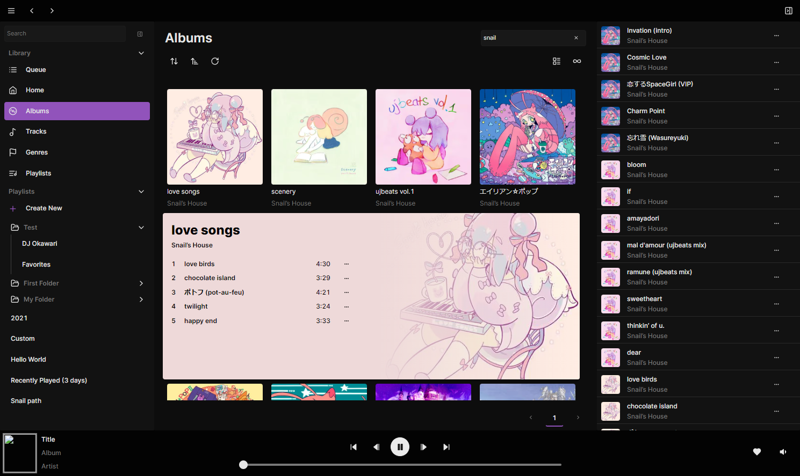

# audioling

  

    
    <!-- 
     -->
  

  

    
    
  

Rewrite of [feishin](https://github.com/jeffvli/feishin)

## FAQ

### What differentiates audioling from feishin?

The rewrite will have a larger focus on performance and user experience. Audioling is built on top of [tauri v2](https://github.com/tauri-apps/tauri) as opposed to [electron](https://www.electronjs.org/) which was used for both Feishin and Sonixd. It also incorporates a local backend server to allow for greater flexibility in how the app can interface with your media server as well as potentially other sources in the future.

Some of the UX considerations for audioling include:

-   Drag/drop queue builder
-   Drag/drop playlist builder
-   Playlist folders
-   Inline album preview from list views (Similar to MusicBee)
-   Responsive design to support mobile devices
-   [If you have any other suggestions, please let me know!](https://github.com/audioling/audioling/discussions)

It will include support for the existing set of media servers:

-   Any OpenSubsonic or Subsonic server (on MVP release)
-   Navidrome (after MVP release)
-   Jellyfin (after MVP release)

### What is the timeline for the MVP release?

I plan to have the MVP released by the end of 2024 (tentative).

### What media playback options will be included in audioling?

The app will support the same playback options as Feishin:

-   MPV
-   Web Audio / HTML Audio

### I have a feature request, how should I submit it?

Please use the [discussions board](https://github.com/audioling/audioling/discussions) to submit feature requests. If it's an existing feature of Feishin, you most likely won't need to submit it as it will likely be included in the rewrite at some point. If it's something that doesn't exist in Feishin yet, please go ahead and submit it.

### What is the best way to stay updated on the project?

Please star the repo and follow the project for updates. You can also join the [Discord](https://discord.gg/FVKpcMDy5f) or [Matrix](https://matrix.to/#/#sonixd:matrix.org) servers where I may post periodic updates and answer questions.

### What does the new app look like?

Here's a preview of the current UI (work in progress and heavily subject to change).

### How do I contribute to the project?

If you are a **designer** and have ideas for the UI/UX, please join the [Discord](https://discord.gg/FVKpcMDy5f) or [Matrix](https://matrix.to/#/#sonixd:matrix.org) servers where we can discuss your ideas.

Code contributions are currently closed as the project is still unstable and in the early stages of development. I will add development guidelines once the project is more stable.
